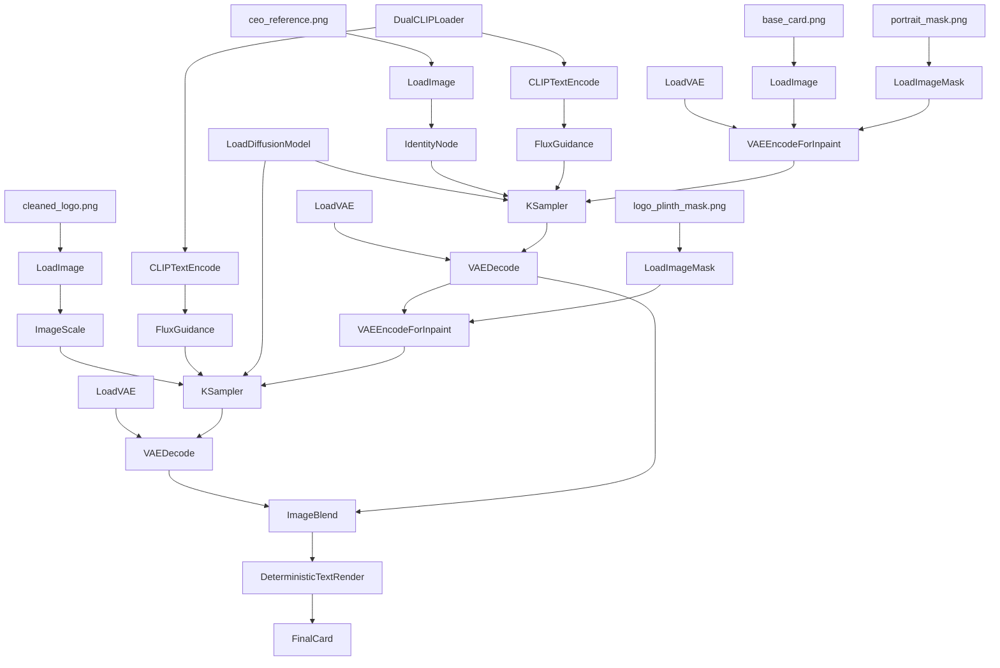

# BAM Cards: CEO Card Generation Onboarding

## Purpose

This document explains how to build the new `bam-cards` repo from scratch for a new engineer who knows very little about the project.

The goal is to build a system that:

- takes a company logo, CEO portrait, and structured card data
- produces a premium BAM card in a fixed visual format
- uses AI only where AI is actually needed
- keeps layouts, coordinates, and business data deterministic
- enforces strict Docker and configuration discipline from day one

This document covers:

- what the repo is for
- how the repo must be structured
- what files must exist
- what `.cursor/rules` must enforce
- how assets must be prepared
- which Comfy functions/nodes to use
- which starting parameters to use
- the linear workflow
- the DAG

This document does **not** define:

- Docker implementation details line by line
- Python orchestration code
- deployment commands
- API payload code

It defines the architecture and implementation spec.

## What BAM Cards Builds

Each BAM card is a top-trumps-style CEO card containing:

- a fixed BAM card frame and background
- a portrait of the CEO
- a company logo on the top plinth
- the CEO name
- five scores
- a summary/details block

The final system must split the job into two types of work:

1. **Generated work**
   - the CEO portrait, blended with unique background
   - the visible embossed/raised appearance of the top plinth logo

2. **Deterministic work**
   - card frame
   - card dimensions
   - card masks
   - logo source asset selection
   - name text
   - score values
   - details text
   - all layout coordinates
   - all fonts and colors

That split is a core design rule.

## Non-Negotiable Engineering Rules

These rules must be drilled in from the first commit. They are not optional.

## Rule 1: No Defaults In Logic

No Python or TypeScript logic file may contain hardcoded defaults for:

- model names
- image sizes
- coordinates
- ports
- prompt templates
- guidance values
- step counts
- retry limits
- timeouts
- font names
- font sizes
- color values
- asset paths
- {all others}

Those values belong in config registries only. All paths, python specific config etc, must all be not in the inline code. Everything gets pulled into from yaml.

### Forbidden

```python
steps = 30
guidance = 4.0
logo_width = 320
port = 8000
```

### Required

```python
steps = settings.generation.portrait.steps
guidance = settings.generation.portrait.guidance
logo_width = settings.layout.logo.width
port = settings.app.server.port
```

If a value is important enough to exist, it is important enough to live in config.

## Rule 2: Docker Standards Are Mandatory

The new repo must strongly adhere to these Docker rules:

- use `docker compose`, never `docker-compose`
- use `compose.yaml`, never `docker-compose.yml`
- do **not** add a `version:` key to `compose.yaml`
- pin Docker base image versions, never use `latest`
- every service must have a `.dockerignore`
- secrets must not be baked into images
- runtime secrets must be injected properly
- containers must be the default dev environment

These rules must be called out repeatedly in repo docs and rules.

## Rule 3: Config Over Code

All runtime behavior lives in config registries.

That means:

- backend runtime values live in `backend/configs/*.yaml`
- frontend runtime values live in `frontend/config/*.ts`
- secrets are registered in `secrets/secrets-registry.yaml`
- AI workflow variable mapping lives in dedicated workflow config

## Rule 4: Clear Boundaries

The repo must maintain hard boundaries:

- `backend/` for API, orchestration, validation, deterministic rendering
- `frontend/` for UI only
- `assets/` for visual assets
- `data/` for structured data and outputs
- `workflows/` for Comfy graphs and prompt templates
- `docs/` for architecture and runbooks
- `infrastructure/` for container and deployment files

No mixing.

## Rule 5: Deterministic Means Deterministic

Anything that can be exact must remain exact.

That includes:

- stats
- text
- fonts
- coordinates
- final layout
- logo source file selection

AI should only be used where exact placement alone cannot achieve the intended look.

## Core Product Decision

The final BAM card should be built with **two generated visual regions**, not one:

1. the portrait window
2. the top logo plinth appearance

This means the top logo is **not** just a flat deterministic paste.

The correct model is:

- the company logo source file is deterministic
- the logo asset is cleaned and standardized deterministically
- the visible top logo treatment is then rendered or reintegrated to look embossed, raised, and native to the card plinth

So the logo is both:

- deterministic as an **input asset**
- generated as a **surface treatment result**

That distinction must be made explicit in the repo docs.

## New Repo Name

The new repo name remains:

`bam-cards`

## Repo Tree

This is the recommended top-level structure for the repo.

```text
bam-cards/
├── .cursor/
│   └── rules/
│       ├── bam-cards.mdc
│       ├── config-management.mdc
│       ├── docker-standards.mdc
│       ├── negative-constraints.mdc
│       └── python-standards.mdc
├── docs/
│   ├── architecture/
│   │   ├── ceo-card-generation-onboarding.md
│   │   ├── workflow-dag.md
│   │   ├── asset-preparation.md
│   │   └── config-philosophy.md
│   ├── operations/
│   │   ├── batch-runbook.md
│   │   ├── qa-checklist.md
│   │   └── troubleshooting.md
│   └── decisions/
│       ├── adr-001-zero-defaults.md
│       ├── adr-002-deterministic-layout.md
│       └── adr-003-embossed-logo-stage.md
├── infrastructure/
│   ├── compose.yaml
│   ├── Makefile
│   ├── backend/
│   │   ├── Dockerfile
│   │   ├── .dockerignore
│   │   └── entrypoint.sh
│   └── frontend/
│       ├── Dockerfile
│       ├── .dockerignore
│       └── nginx.conf
├── secrets/
│   └── secrets-registry.yaml
├── workflows/
│   ├── comfy/
│   │   ├── portrait_inpaint.json
│   │   ├── logo_plinth_render.json
│   │   ├── final_card_visual.json
│   │   └── examples/
│   └── api/
│       ├── prompt-template.json
│       ├── variable-map.json
│       └── execution-notes.md
├── assets/
│   ├── templates/
│   │   ├── base_card.png
│   │   ├── portrait_mask.png
│   │   ├── logo_plinth_mask.png
│   │   ├── logo_input_mask.png
│   │   └── preview_card.jpg
│   ├── logos/
│   │   ├── raw/
│   │   ├── cleaned/
│   │   └── embossed-previews/
│   ├── portraits/
│   │   ├── raw/
│   │   └── standardized/
│   ├── fonts/
│   ├── icons/
│   └── branding/
├── data/
│   ├── input/
│   │   ├── ceos.csv
│   │   ├── companies.csv
│   │   └── cards.csv
│   ├── processed/
│   │   ├── manifests/
│   │   ├── logos/
│   │   └── portraits/
│   └── output/
│       ├── renders/
│       ├── previews/
│       └── final/
├── backend/
│   ├── pyproject.toml
│   ├── uv.lock
│   ├── alembic.ini
│   ├── configs/
│   │   ├── app.yaml
│   │   ├── cards.yaml
│   │   ├── generation.yaml
│   │   ├── assets.yaml
│   │   ├── layout.yaml
│   │   └── workflow.yaml
│   ├── migrations/
│   │   ├── env.py
│   │   ├── script.py.mako
│   │   └── versions/
│   ├── src/
│   │   ├── __init__.py
│   │   ├── main.py
│   │   ├── config.py
│   │   ├── auth.py
│   │   ├── database.py
│   │   ├── schemas.py
│   │   ├── api/
│   │   │   ├── __init__.py
│   │   │   ├── health.py
│   │   │   ├── cards.py
│   │   │   ├── subjects.py
│   │   │   └── assets.py
│   │   ├── models/
│   │   │   ├── __init__.py
│   │   │   ├── base.py
│   │   │   ├── card.py
│   │   │   ├── company.py
│   │   │   ├── executive.py
│   │   │   └── render_job.py
│   │   ├── repositories/
│   │   │   ├── __init__.py
│   │   │   ├── card_repository.py
│   │   │   └── asset_repository.py
│   │   └── services/
│   │       ├── __init__.py
│   │       ├── workflow_service.py
│   │       ├── portrait_service.py
│   │       ├── logo_service.py
│   │       ├── identity_service.py
│   │       ├── asset_pipeline_service.py
│   │       ├── text_layout_service.py
│   │       ├── card_renderer.py
│   │       ├── data_service.py
│   │       └── image_generator.py
│   └── tests/
│       ├── __init__.py
│       ├── conftest.py
│       ├── test_config.py
│       ├── test_layouts.py
│       ├── test_workflow_mapping.py
│       ├── test_logo_processing.py
│       └── test_card_rendering.py
├── frontend/
│   ├── package.json
│   ├── components.json
│   ├── tsconfig.json
│   ├── tsconfig.app.json
│   ├── tsconfig.node.json
│   ├── vite.config.ts
│   ├── index.html
│   ├── config/
│   │   ├── index.ts
│   │   ├── api.ts
│   │   ├── routes.ts
│   │   ├── theme.ts
│   │   ├── layout.ts
│   │   └── copy.ts
│   ├── src/
│   │   ├── main.tsx
│   │   ├── App.tsx
│   │   ├── index.css
│   │   ├── api/
│   │   │   └── client.ts
│   │   ├── lib/
│   │   │   ├── utils.ts
│   │   │   ├── query.ts
│   │   │   └── types.ts
│   │   ├── components/
│   │   │   ├── ui/
│   │   │   ├── cards/
│   │   │   │   ├── CardPreview.tsx
│   │   │   │   ├── CardMetadataPanel.tsx
│   │   │   │   └── RenderStatusBadge.tsx
│   │   │   └── forms/
│   │   │       ├── CardFilterForm.tsx
│   │   │       └── RenderControls.tsx
│   │   └── views/
│   │       ├── LoginPage.tsx
│   │       ├── DashboardPage.tsx
│   │       ├── CardsPage.tsx
│   │       └── AssetsPage.tsx
├── .env.example
├── .gitignore
├── project.md
└── setup.md
```

## What Each Top-Level Area Does

## `.cursor/rules/`

This folder defines the behavior the engineering agent and future contributors must follow.

It must be recreated in the new repo and treated as part of the architecture, not as optional editor decoration.

### `bam-cards.mdc`

Defines:

- single source of truth
- hard folder boundaries
- config-over-code discipline
- separation between backend, frontend, infrastructure, and docs

### `config-management.mdc`

Defines:

- backend YAML config ownership
- frontend config ownership
- secret registration rules
- no inline config in UI or Python logic

### `docker-standards.mdc`

Defines:

- Compose V2 rules
- Docker naming rules
- pinned images
- no `version:` key
- `.dockerignore` requirements
- secret injection behavior

### `negative-constraints.mdc`

Defines what must **never** be done.

This includes:

- no `requirements.txt`
- no `docker-compose`
- no hardcoded hyperparameters
- no hardcoded ports or paths
- no secrets in source/config

### `python-standards.mdc`

Defines:

- naming
- type hints
- docstrings
- file size rules
- no magic values
- strict logging behavior

## `docs/`

This is the human-readable explanation layer.

A new engineer should be able to understand the system by starting here.

### `docs/architecture/`

Contains:

- this onboarding document
- workflow explanation
- config philosophy
- asset prep reference

### `docs/operations/`

Contains:

- runbooks
- QA process
- troubleshooting

### `docs/decisions/`

Contains architectural decision records so important design choices do not disappear into chat history.

## `infrastructure/`

Contains container and deployment files only.

It must not contain business logic, prompt templates, or application defaults.

## `secrets/`

Contains the registry of expected secret keys.

No actual secret values live here.

## `workflows/`

Contains Comfy workflows and API payload mapping.

This must be treated as a first-class system area, not a miscellaneous folder.

## `assets/`

Contains binary and visual source materials:

- card templates
- masks
- cleaned logos
- standardized portraits
- fonts
- icons

## `data/`

Contains structured input records, processed manifests, and output renders.

This is business data, not application logic.

## `backend/`

Contains:

- API
- orchestration
- config loading
- database
- deterministic rendering
- workflow mapping

The backend is the system brain.

## `frontend/`

Contains the operator UI only.

It must not contain generation logic or business defaults.

## Day-One Bootstrap Files

These files should exist on day one of the new repo:

- `.cursor/rules/*.mdc`
- `project.md`
- `setup.md`
- `infrastructure/compose.yaml`
- `infrastructure/backend/Dockerfile`
- `infrastructure/frontend/Dockerfile`
- `secrets/secrets-registry.yaml`
- `backend/pyproject.toml`
- `backend/uv.lock`
- `backend/configs/app.yaml`
- `backend/configs/cards.yaml`
- `backend/configs/generation.yaml`
- `backend/configs/assets.yaml`
- `backend/configs/layout.yaml`
- `backend/configs![[]]/workflow.yaml`
- `frontend/config/index.ts`
- `frontend/config/api.ts`
- `frontend/config/routes.ts`
- `frontend/config/theme.ts`
- `workflows/comfy/portrait_inpaint.json`
- `workflows/comfy/logo_plinth_render.json`
- `assets/templates/base_card.png`
- `assets/templates/portrait_mask.png`
- `assets/templates/logo_plinth_mask.png`

Without these files, the repo is not meaningfully bootstrapped.

## Asset Preparation Rules

Asset preparation is part of the system design, not a side task.

Bad asset prep causes bad cards.

## Final Card Canvas

Use one standard production card size:

- `1536 x 2176 px`

This size should drive:

- base card export
- masks
- preview scaling rules
- layout coordinates

Do not define this in Python source code.
It must live in YAML config.

## Required Template Assets

### `base_card.png`

The fixed BAM card template.

Contains:

- card frame
- card background
- crest/plinth design
- portrait window frame
- text regions
- icon regions

Does not contain:

- final CEO portrait
- final top logo appearance
- final CEO name
- final score text

### `portrait_mask.png`

The mask controlling the portrait generation region.

- white = AI may redraw
- black = protected

Only the portrait window should be white.

### `logo_plinth_mask.png`

The mask controlling where the top logo render is allowed to appear.

This defines the raised/logo plinth surface region.

### `logo_input_mask.png`

Optional helper mask if the logo source needs preprocessing before being used inside the plinth render stage.

## CEO Portrait Standardization

Every CEO image should be standardized before generation.

Recommended portrait source target:

- `1024 x 1280 px`

Rules:

- vertical crop
- face centered
- face clear and large enough
- shoulders visible if possible
- avoid tiny face crops
- avoid extreme JPEG damage
- avoid background removal unless testing proves it helps

The portrait source is not meant to be pasted directly.
It is a reference input for identity conditioning.

## Logo Standardization

Every logo must be cleaned before the main workflow.

Recommended standardized logo source target:

- `1024 x 1024 px`
- transparent PNG
- centered

Rules:

- remove white boxes or flat backgrounds
- preserve edges
- center logo
- keep the logo exact as a brand asset

The logo source is deterministic.
The visible logo plinth treatment is generated from that exact source.

## Logo Treatment: Correct Model

This point must be understood correctly.

The top logo is **not** a flat pasted badge.

The correct approach is:

1. choose the exact company logo deterministically
2. clean and standardize it deterministically
3. use it as the source input into a controlled render stage
4. render/reintegrate it into the top plinth so it looks raised, embossed, and native to the card material

So the logo stage is:

- deterministic in source selection
- generated in surface appearance

This is different from the portrait stage because:

- portrait stage solves identity + realism
- logo stage solves material integration + embossed appearance

## Required Config Files

The new repo should centralize runtime values into these backend config files.

## `backend/configs/app.yaml`

Contains:

- host
- port
- workers
- log level
- auth realm
- CORS settings
- database connection metadata
- asset root locations

## `backend/configs/cards.yaml`

Contains:

- card width/height
- output mode
- output quality
- font registry names
- text color definitions
- summary rendering settings

## `backend/configs/assets.yaml`

Contains:

- accepted input formats
- portrait standardization size
- logo standardization size
- template asset locations
- output directories

## `backend/configs/layout.yaml`

Contains:

- portrait box coordinates
- top logo plinth coordinates
- name box coordinates
- stat row coordinates
- details box coordinates

No layout number may live in code.

## `backend/configs/generation.yaml`

Contains:

- provider names
- model identifiers
- FLUX/Comfy generation parameters
- guidance values
- step counts
- seed policy
- retry config
- prompt templates
- negative prompts if used

No hyperparameter may live in code.

## `backend/configs/workflow.yaml`

Contains:

- workflow file selection
- node id mapping
- runtime variable injection mapping
- which inputs feed which workflow node

## Comfy Workflow Design

The system should be split into **three workflow concerns**:

1. portrait generation
2. logo plinth rendering
3. final visual assembly

The final card text and numeric data should still be rendered deterministically in the backend unless a later design explicitly moves it.

## Function / Node Guide

This section lists the important Comfy functions/nodes and what each is for.

## 1. `LoadImage`

Use for:

- `base_card.png`
- `ceo_reference.png`
- `cleaned_logo.png`

Purpose:

- load image assets into the graph

Output:

- image tensor

## 2. `LoadImageMask`

Use for:

- `portrait_mask.png`
- `logo_plinth_mask.png`
- optional helper masks

Purpose:

- define which pixels are editable or composited

Output:

- mask tensor

## 3. `DualCLIPLoader`

Use for FLUX text encoders.

Starting values:

- `clip_name1 = t5xxl_fp16.safetensors`
- `clip_name2 = clip_l.safetensors`
- `type = flux`

Purpose:

- load the text encoders needed by FLUX workflows

Output:

- combined CLIP object

## 4. `Load Diffusion Model`

Starting value:

- `flux1-fill-dev.safetensors`

Purpose:

- load the diffusion model used for inpainting or fill stages

Output:

- diffusion model

## 5. `Load VAE`

Starting value:

- `ae.safetensors`

Purpose:

- convert between image space and latent space

Output:

- VAE object

## 6. Identity Conditioning Node

Use:

- `PuLID for FLUX` or another FLUX-compatible identity node

Purpose:

- inject the CEO identity into portrait generation

Starting values:

- `weight = 0.85`
- `start_at = 0.0`
- `end_at = 1.0`

Output:

- identity-conditioned generation state

## 7. `CLIPTextEncode`

Use for:

- portrait style prompt
- logo plinth render prompt

Purpose:

- convert prompt text into conditioning

Output:

- conditioning

## 8. `FluxGuidance`

Starting values:

- portrait guidance: `4.0`
- logo plinth guidance: `3.0` to `4.0`

Purpose:

- set prompt influence for FLUX workflows

Output:

- FLUX conditioning with guidance

## 9. `VAEEncodeForInpaint`

Use for:

- portrait inpaint stage
- logo plinth render stage if done as a masked inpaint on the card surface

Starting values:

- portrait `grow_mask_by = 12`
- logo plinth `grow_mask_by = 6` to `10`

Purpose:

- create masked inpaint latents

Output:

- inpaint latent

## 10. `KSampler`

Starting values for first tests:

- `steps = 30`
- `denoise = 1.0`
- fixed seed while calibrating

Purpose:

- execute the actual generation

Output:

- generated latent

Important:

Do not hardcode these values in Python.
These must live in `generation.yaml`.

## 11. `VAEDecode`

Purpose:

- turn latent output back into a visible image

Output:

- rendered image

## 12. `ImageScale`

Use for:

- scaling the standardized logo input before plinth rendering or compositing

Purpose:

- resize input to exact target dimensions

Output:

- scaled image

## 13. `ImageCompositeMasked`

Use for:

- exact compositing
- controlled region insertion

Purpose:

- place one image onto another at known coordinates

Output:

- composited image

## 14. `ImageBlend`

Use for:

- material integration
- embossed logo appearance refinement

Starting values:

- `blend_mode = overlay`
- `blend_factor = 0.45`

Purpose:

- make the logo treatment look integrated with the plinth material

Output:

- blended image

## Starting Parameter Set

These are the first-pass values to start from.

They are starting points only.

They still belong in config.

## Portrait Stage

- source portrait standardized to `1024 x 1280`
- canvas `1536 x 2176`
- identity weight `0.85`
- guidance `4.0`
- steps `30`
- denoise `1.0`
- grow mask by `12`

## Logo Plinth Stage

- source logo standardized to `1024 x 1024`
- guidance `3.5`
- steps `24` to `30`
- denoise `1.0`
- grow mask by `8`
- blend mode `overlay`
- blend factor `0.45`

## Output Stage

- output card `1536 x 2176`
- final output format and quality from YAML only

## Prompt Direction

Prompts should describe the generated region only.

## Portrait Prompt Start

Use a prompt similar to:

`photorealistic corporate executive portrait, premium business attire, clean studio lighting, realistic skin texture, professional expression, centered upper torso, elegant teal-toned background, high detail, editorial photography`

Do not mention:

- card frame
- score text
- logo typography
- icons

## Logo Plinth Prompt Start

Use a prompt similar to:

`embossed corporate logo integrated into a premium raised card plinth, subtle material depth, realistic highlights and shadow, centered, clean, elegant, native to the card surface`

Do not ask the model to invent a new brand.
The brand logo source is already provided.

## Linear Workflow

This is the correct build order.

## Stage 1: Prepare Assets

1. export `base_card.png`
2. export `portrait_mask.png`
3. export `logo_plinth_mask.png`
4. clean all logos to transparent PNGs
5. standardize all CEO portraits
6. validate filenames and input records

## Stage 2: Portrait Generation

1. load base card
2. load portrait mask
3. load CEO portrait reference
4. load FLUX model components
5. apply identity conditioning
6. encode portrait prompt
7. apply guidance
8. encode inpaint latent for the portrait region
9. sample portrait result
10. decode portrait result

Output:

- card with newly rendered CEO portrait

## Stage 3: Logo Plinth Rendering

1. load cleaned deterministic logo asset
2. scale it to the plinth input target
3. load logo plinth mask
4. feed logo source into the plinth render workflow
5. render/reintegrate the logo so it looks raised and material-aware
6. decode result if needed
7. composite/blend into the card

Output:

- card with portrait plus raised top logo treatment

## Stage 4: Deterministic Finalization

1. render CEO name
2. render stat labels
3. render stat values
4. render details paragraph
5. export final card file

Output:

- final BAM card

## Main DAG



## What Must Stay Out Of The AI Stage

These must remain deterministic:

- CEO name text
- stat labels
- stat numbers
- details paragraph
- text wrapping
- font choice
- font size
- text color
- card coordinates
- business data lookup

If these move into the AI stage, the system becomes fragile.

## Common Violations To Call Out In Code Review

These should be explicitly rejected.

### Violation: hardcoded step count

```python
steps = 30
```

Why it is wrong:

- it hides runtime behavior in code
- it breaks the zero-default mandate
- it makes tuning harder

Correct home:

- `backend/configs/generation.yaml`

### Violation: hardcoded plinth logo size

```python
logo_width = 320
logo_height = 160
```

Why it is wrong:

- layout belongs in config

Correct home:

- `backend/configs/layout.yaml`

### Violation: hardcoded port

```python
uvicorn.run(app, host="0.0.0.0", port=8000)
```

Why it is wrong:

- app runtime belongs in config

Correct home:

- `backend/configs/app.yaml`

### Violation: Docker image uses latest

```dockerfile
FROM python:latest
```

Why it is wrong:

- non-reproducible
- violates Docker standards

Correct approach:

- pin the exact image version

## Final Implementation Summary

The new `bam-cards` repo should be built around these truths:

1. the card layout is deterministic
2. the portrait is generated in a masked region
3. the top logo plinth treatment is also generated in a controlled masked region
4. the logo brand asset itself is deterministic
5. all hyperparameters live in YAML
6. all layout values live in YAML
7. all frontend constants live in `frontend/config/`
8. Docker standards are mandatory, not optional
9. zero defaults in logic must be enforced continuously
10. the repo must teach these rules to the next engineer immediately through structure and docs
